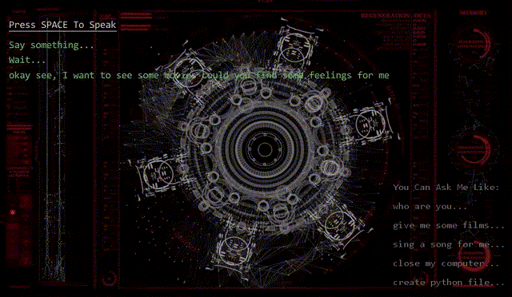

## Sigma v1.0

### 1. Introduction

Sigma 是一个用正则匹配实现的语音助手，它可以读懂一些特定的指令并完成一些指定的功能，下图是和 Sigma 聊天的过程：

<div align=center></div>

你还可以跟 sigma 说“我想要看一部电影”，sigma 会为你打开浏览器并跳转到视频网站让你选择你想要观赏的视频：

<div align=center></div>

### 2. Usage

* **clone 该项目并下载相关依赖包：**

```bash
git clone https://github.com/HarderThenHarder/sigma.git
cd sigma
```

* **运行sigma**

```bash
python Main.py
```

